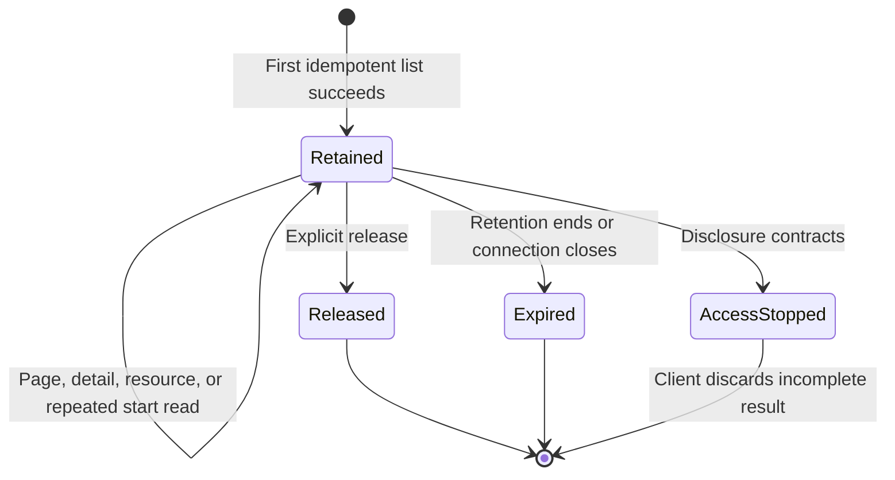
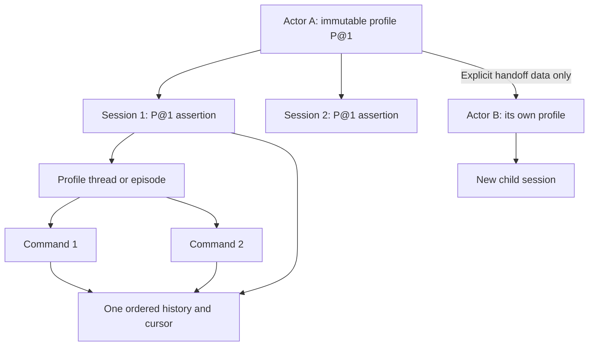
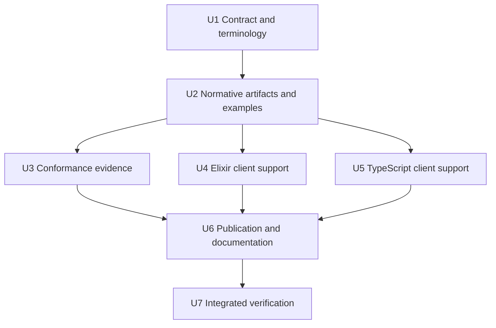

# Progressive Capability Discovery - Plan

## Goal Capsule

- **Objective:** Add a versioned DASP capability discovery contract that lets an authenticated client learn an actor's one exact profile, enumerate that actor's advertised commands, inspect selected command details, and obtain complete JSON Schema input and output contracts before it confirms the profile and opens a session.
- **Authority hierarchy:** Product Requirements define observable behavior. Key Technical Decisions define the protocol mechanism. Implementation Units define the delivery order and file boundaries.
- **Execution profile:** Deep protocol work across normative specification text, schemas, conformance evidence, both language clients, and publication tooling.
- **Stop conditions:** Stop and return to protocol design if the work adds authorization semantics, changes the fourteen core message types, permits session open without the actor's exact profile contract, lets one actor use several profiles, adds a core thread or turn, joins a child actor to a parent session, or normalizes schema resources through DASP portable JSON.
- **Tail ownership:** The executor owns cross-artifact consistency, client parity, conformance coverage, publication checks, and removal of the superseded dirty-work shape.

---

## Product Contract

### Summary

DASP will add optional capability discovery before normal session open. Each actor has one exact profile URI and version for its lifetime. Discovery will return that profile descriptor and expose a complete, stable, paged summary of the capabilities advertised for one host-resolved view of the actor. A client will fetch details and exact JSON Schema resources only for commands that it needs. Discovery will describe capabilities. It will not grant permission, choose a profile, or promise command admission.

### Problem Frame

A DASP command is intentionally generic. The actor's one profile gives each command its domain meaning. A client that does not know the actor's exact profile and advertised command set cannot safely choose a command or its input shape.

The profile owns the capability universe. It defines which capabilities are required and which are optional. The actor can activate optional capabilities. The host can filter disclosure for one authenticated view. Neither the actor nor the advertised view can create a capability outside the profile.

Many sessions can bind to the same actor. Every session repeats the actor's exact profile tuple as an assertion and compatibility guard. The tuple is not a choice. The host rejects a mismatch. An incompatible profile change needs a new actor identity or a future explicit migration protocol.

DASP core already separates one transport attempt, one durable intent, and one actor history through `requestid`, `command_id`, and `session_id`. A profile can define a thread or episode below one session when several commands form one correlated interaction. That profile-owned structure shares the session history and cursor. It does not add core admission, replay, recovery, or cursor rules.

The current dirty work adds one static `dasp.profile.capabilities` document with up to 500 inline command schemas. This shape is useful as an experiment, but it is not a complete actor discovery protocol. It has no actor target, advertised view, stable snapshot, paging, selective detail read, change signal, or exact schema-resource transfer. It also requires all commands and schemas in one document.

The existing extension lifecycle cannot directly solve the pre-session problem. It binds an exact profile and extension set before any core operation. Discovery must happen after peer authentication but before the client confirms the actor's exact profile and opens a session. DASP therefore needs a small companion contract at the binding setup boundary.

### Actors

- A1. **DASP client:** Knows a trusted endpoint and actor identity, but may not know the actor's immutable profile tuple or advertised command catalog.
- A2. **Authenticated binding:** Authenticates peers, selects the exact discovery contract, carries its operations, and later confirms the operational DASP contract.
- A3. **DASP host:** Resolves the actor's one profile and advertised view, creates stable snapshots, enforces disclosure policy, and serves capability and schema resources.
- A4. **Profile author:** Publishes the capability universe, required and optional capability rules, full profile behavior, and the input and output schema resources referenced by commands.

### Requirements

**Contract placement and meaning**

- R1. Capability discovery MUST be an optional, versioned setup subprotocol selected with an exact authenticated binding mapping before actor profile confirmation and session open.
- R2. The discovery contract MUST NOT add or change any DASP core request, reply, cursor, retry, admission, update, outcome, or session rule.
- R3. An advertised capability MUST mean only that the host describes a command for one actor and one resolved advertised view at one snapshot boundary.
- R4. Discovery MUST NOT select a profile, authorize a command, grant access, prove availability, or promise later admission or execution.
- R5. A client MUST support the actor's exact discovered profile contract before it can assert that tuple and open a session.

**Progressive and complete discovery**

- R6. The contract MUST provide a summary-list operation, a selective-detail operation, an exact schema-resource read operation, and an idempotent snapshot-release operation.
- R7. The first summary-list response MUST return the actor's exact profile descriptor, create an immutable snapshot, and return a bounded first page.
- R8. Each continuation token MUST be opaque and bound to the authenticated client context, actor, actor profile tuple, resolved advertised view, normalized query, snapshot, operation, and discovery contract version.
- R9. All pages in one successful enumeration MUST use one snapshot, one actor profile tuple, and deterministic ordering.
- R10. The terminal page MUST omit the continuation token and MUST state that the enumeration is complete.
- R11. Complete enumeration MUST include every capability in the resolved advertised view, but the contract MUST NOT require a total count.
- R12. A valid current-context snapshot MUST fail with `stale_snapshot` after retention ends, while an unknown, forged, or foreign-context identity MUST use the masked unavailable failure.
- R13. A selective-detail request against one snapshot MUST be atomic and MUST return no partial data or failing-item identity when any requested capability identity is unavailable.
- R14. The selected contract MUST state carrier-neutral limits for item counts, UTF-8 control bytes, exact resource bytes, closure bytes, opaque-value bytes, live snapshots, and snapshot retention.

**Scoped advertised views**

- R15. A client MAY send a bounded typed opaque advertised-view selector, but the selector MUST carry no credentials, grants, policy, or authority.
- R16. The host MUST resolve the selector only within the maximum disclosure set supplied by its external security system and MUST return an opaque resolved-view identity.
- R17. The host MUST use one masked failure shape for absent, inaccessible, undisclosed, forged, foreign-context, wrong-actor, and wrong-version targets.
- R18. The host MUST perform a fresh disclosure check before every page, detail, resource, and release response without changing snapshot contents.
- R19. If disclosure contracts during retrieval, the host MUST stop later reads, and the client MUST discard any incomplete result.

**JSON Schema contracts**

- R20. Each command detail MUST identify one input root resource and one output root resource for JSON Schema Draft 2020-12.
- R21. Schema transfer MUST preserve the exact `application/schema+json` representation, including boolean schemas, fractional numbers, unknown annotations, extension keywords, and compound schema documents.
- R22. Each command detail MUST provide a closed manifest for all required non-standard schema resources and vocabularies.
- R23. A client MUST NOT fetch or load a URI, file, code module, vocabulary, or format only because it occurs in a selector, resource identity, schema keyword, or annotation.
- R24. The output schema MUST validate every non-null `Outcome.output`, while the actor's profile remains authoritative for status-specific completion rules.
- R25. Resource identity, optional representation digest, schema `$id`, and discovery snapshot identity MUST remain separate identity domains.
- R26. A representation digest, when present, MUST cover the complete exact representation after transport decoding and MUST identify its algorithm and media type.

**Refresh, security, and compatibility**

- R27. Version 1 MUST use explicit refresh and MUST NOT define a push invalidation or capability-delta channel.
- R28. A refresh during an existing session MUST NOT change that session's profile, saved protection floor, command admission, replay facts, or update cursor.
- R29. Human-readable names, labels, descriptions, schema annotations, defaults, and examples MUST be bounded and treated as untrusted, non-normative data.
- R30. If a peer does not support the exact discovery contract, a client MAY continue only with exact configured profile knowledge and an explicit local policy that permits operation without discovery.
- R31. Both shipped clients MUST expose equivalent incremental support for summary pages, details, resource descriptors, failures, and exact-byte resources without adding discovery to the core signal registry.
- R32. Normative schemas, examples, conformance requirements, runtime cases, publication maps, artifact digests, and client schema copies MUST describe the same contract version.

**Security, integrity, and scale controls**

- R33. Each discovered profile descriptor MUST include its exact URI, version, immutable content reference, and compatible core contract information for later independent compatibility confirmation.
- R34. Each server-issued discovery identity MUST be non-authorizing, context-bound, expiring, resistant to guessing and forgery, and free of sensitive clear text.
- R35. A resource transfer MUST declare its exact byte length and permit incremental length and digest verification without requiring full-value buffering.
- R36. Host and client caches MUST be partitioned by endpoint, peer, authenticated context, actor, actor profile tuple, contract version, resolved view, snapshot, and resource, then discarded on context change, disclosure contraction, or integrity failure.
- R37. The first list request MUST have an idempotency identity, and a repeated valid start or continuation request MUST return the same logical snapshot and page while retained.
- R38. Clients MUST reject continuation-token loops, duplicate pages, duplicate capability identities, mixed actor profiles, mixed snapshots or views, altered continuation parameters, and local page or byte limit overruns.
- R39. Schema resource verification MUST reject duplicate JSON keys, unresolved references, ambiguous identifiers or anchors, and unsupported required vocabularies.
- R40. Every nonterminal page MUST contain at least one new summary, and an item or view that cannot fit MUST fail with a typed limit result instead of truncation or an empty continuation loop.
- R41. Discovery snapshots MUST be read-only, non-durable, connection-scoped setup state, and connection loss MUST require a new enumeration.
- R42. Any optional schema compilation or evaluation MUST use local work limits and MUST NOT load discovered code.

**Actor, profile, session, and handoff invariants**

- R43. Each actor MUST have one exact profile URI and version for its lifetime.
- R44. An incompatible profile change MUST use a new actor identity unless a future explicit migration protocol defines another safe transition.
- R45. The profile tuple in `session.open` MUST assert the actor's profile and MUST NOT select among profiles.
- R46. The host MUST reject `session.open` when its profile tuple does not equal the actor's immutable profile tuple.
- R47. A profile MUST define its capability universe and classify each capability as required or optional.
- R48. An actor's effective capability set MUST contain its profile's required capabilities and MAY contain activated optional capabilities, but it MUST NOT contain a capability outside the profile.
- R49. An advertised view MUST be a disclosure projection of the actor's effective capability set and MUST NOT create or activate a capability.
- R50. Capability identity MUST remain the exact profile URI, exact profile version, and command name.
- R51. Many sessions MAY bind to one actor, but every session MUST use that actor's one immutable profile tuple and keep its own ordered history and cursor.
- R52. A profile MAY define a thread or episode as application state under one session to group related commands as one correlated interaction.
- R53. A profile-owned thread or episode MUST stay within one session and MUST share that session's ordered history and cursor.
- R54. A profile-owned thread or episode MUST NOT have independent core admission, replay, recovery, or cursor semantics in version 1.
- R55. A command MUST remain the core unit closest to a turn, and a profile MAY define `turn_id` only when its meaning differs from `command_id`.
- R56. A sub-actor MUST be either an opaque implementation detail of its parent profile or a unique actor reached through an explicit handoff and a new session.
- R57. A child actor profile MUST NOT join the parent session.
- R58. Child discovery, profile confirmation, disclosure, admission, history, and recovery MUST run independently from the parent.
- R59. Parent and child profiles MAY carry link or correlation data, but authority and discovery state MUST NOT transfer automatically.

### Key Flows

- F1. **Pre-session discovery and profile confirmation**
  - **Trigger:** A1 knows the endpoint and actor identity but does not know the actor's immutable profile tuple or advertised commands.
  - **Actors:** A1, A2, A3
  - **Steps:** A2 selects and authenticates an exact discovery-capable binding mapping. A1 receives the actor's one exact profile descriptor, then reads a complete capability snapshot, selected details, and required schema resources. A1 confirms support for that profile and repeats the tuple as an assertion during normal DASP session open.
  - **Outcome:** The client has a complete advertised command view for the actor's one profile and remains subject to normal compatibility checks and admission.
  - **Covered by:** R1-R14, R20-R26, R30, R33-R50

- F2. **Large catalog enumeration**
  - **Trigger:** The resolved advertised view contains more summaries than one page can carry.
  - **Actors:** A1, A3
  - **Steps:** A1 follows opaque continuation tokens. A3 serves only capabilities from the actor's one profile. Every page uses one immutable snapshot, deterministic order, and selected count and byte limits. The final page states completion and has no continuation token.
  - **Outcome:** A1 can prove that it has the complete summary set for that actor profile, advertised view, and snapshot.
  - **Covered by:** R7-R14, R17-R19, R34, R37-R38, R40, R43, R47-R50

- F3. **Selective detail and schema retrieval**
  - **Trigger:** A1 chooses one or more summaries that it may use.
  - **Actors:** A1, A3, A4
  - **Steps:** A1 reads atomic details for exact capability identities. A1 then reads the input and output roots plus their closed resource manifests as exact bytes.
  - **Outcome:** A1 can validate command inputs and every non-null command output without fetching untrusted network resources.
  - **Covered by:** R13, R20-R26, R35, R39, R42

- F4. **Explicit refresh**
  - **Trigger:** A1 refreshes by local policy or encounters an expired snapshot.
  - **Actors:** A1, A2, A3
  - **Steps:** A1 starts a new summary enumeration. A3 returns a new snapshot under the current authenticated context and the same immutable actor profile tuple. Existing sessions and saved DASP facts do not change.
  - **Outcome:** A1 receives a fresh advertised view without changing actor or session profile meaning.
  - **Covered by:** R12, R18-R19, R27-R28, R43-R49

- F5. **Profile-owned interaction grouping**
  - **Trigger:** A profile needs to group several related commands as one thread or episode.
  - **Actors:** A1, A3, A4
  - **Steps:** A4 defines the grouping identifier and its state rules in the profile. A1 sends normal commands in one session with that profile-defined correlation data. A3 records all results in the session's one ordered history.
  - **Outcome:** The application can model a correlated interaction without adding a core thread, turn, cursor, replay stream, or admission unit.
  - **Covered by:** R51-R55

- F6. **Explicit child-actor handoff**
  - **Trigger:** A parent profile exposes work that must continue through another explicit actor.
  - **Actors:** A1, A3, A4
  - **Steps:** The parent returns profile-defined handoff data and the unique child actor identity. A1 discovers the child independently, confirms the child's profile, and opens a new child session. Parent and child sessions keep separate histories, cursors, disclosure checks, and admission decisions.
  - **Outcome:** Parent and child can correlate application work without sharing a session, authority, or discovery state.
  - **Covered by:** R56-R59

### Acceptance Examples

- AE1. **Hundreds of capabilities**
  - **Covers:** R6-R14, R35, R37-R38, R40
  - **Given:** One actor profile defines and advertises 1,000 commands, the applied page limit is 100, and the byte limit does not reduce a page.
  - **When:** The client starts a summary enumeration and follows every returned continuation token.
  - **Then:** The host returns exactly ten pages from one snapshot, the tenth page has no next token and states completion, and the client performs no detail or schema reads.

- AE2. **Descriptive scoped view**
  - **Covers:** R15-R17, R47-R50
  - **Given:** The actor's profile defines required and optional commands, and the client sends an opaque selector for one workspace.
  - **When:** The host resolves the selector under the authenticated context.
  - **Then:** The host returns a resolved-view identity and a disclosure projection of the actor's effective profile capabilities, but it adds no capability and grants no command permission.

- AE3. **Disclosure contracts during paging**
  - **Covers:** R18-R19
  - **Given:** A client has read the first page of a retained snapshot.
  - **When:** Current disclosure policy no longer permits later retrieval.
  - **Then:** The host returns a masked refusal, does not replace the page with data from a new snapshot, and the client discards the incomplete result.

- AE4. **Full JSON Schema**
  - **Covers:** R20-R26
  - **Given:** An input schema is a compound schema document that uses `$dynamicRef`, an unknown annotation, and `multipleOf: 0.01`.
  - **When:** The client reads the schema resource set.
  - **Then:** The client receives the exact schema bytes and the closed dependency manifest without converting the schema through DASP portable JSON or fetching a URI from the schema.

- AE5. **Advertisement is not admission**
  - **Covers:** R3-R5, R28, R43-R50
  - **Given:** A command appeared in a completed discovery snapshot.
  - **When:** The client later asserts the actor's profile tuple, opens a session, and submits that command.
  - **Then:** The host can reject it under current policy, actor state, limits, or profile rules without violating the discovery contract.

- AE6. **Unsupported peer fallback**
  - **Covers:** R30
  - **Given:** A peer does not support the exact discovery contract.
  - **When:** The client has exact configured knowledge of the actor's profile and its local policy permits discovery-free operation.
  - **Then:** The client can assert that tuple during normal DASP session open, but it does not guess a profile or infer a weaker fallback from a timeout.

- AE7. **Bounded selective retrieval**
  - **Covers:** R13-R14, R20-R26, R35, R39-R40
  - **Given:** A client selects 10 commands from a completed 1,000-command snapshot and the applied detail batch limit is four.
  - **When:** The client reads the selected details and their schema resource closures.
  - **Then:** It makes three detail requests, reads each unique resource once, streams exact bytes within closure limits, and reads no resource for the other 990 commands.

- AE8. **Foreign identity masking**
  - **Covers:** R12, R17-R19, R34
  - **Given:** A client presents a random, forged, expired, cross-actor, or cross-context discovery identity.
  - **When:** The host checks the identity against the authenticated context and current disclosure decision.
  - **Then:** Only a valid current-context expired snapshot receives `stale_snapshot`; every foreign or unknown identity receives the same masked unavailable response.

- AE9. **Profile assertion mismatch**
  - **Covers:** R43-R46, R51
  - **Given:** Discovery returns profile `P@1` for actor `A`.
  - **When:** The client sends `session.open` for actor `A` with profile `P@2`.
  - **Then:** The host rejects the open as a compatibility mismatch and does not create or attach the session.

- AE10. **Required and optional capabilities**
  - **Covers:** R47-R50
  - **Given:** Profile `P@1` defines command `base.read` as required and `vision.inspect` as optional.
  - **When:** Actor `A` activates `vision.inspect` and the host resolves a view that can disclose both commands.
  - **Then:** Discovery advertises both commands under `P@1`, while another actor with the same profile can advertise only `base.read` if the optional command is not active.

- AE11. **Profile-owned thread**
  - **Covers:** R51-R54
  - **Given:** One profile defines `thread_id` to group several commands in one session.
  - **When:** The client sends those commands with the same `thread_id`.
  - **Then:** Each command keeps its own `command_id`, and all saved facts use the session's one ordered history and cursor.

- AE12. **No redundant turn identity**
  - **Covers:** R55
  - **Given:** A profile models one user turn as one durable command.
  - **When:** The profile defines its command schema.
  - **Then:** It uses `command_id` as the durable turn identity and does not add `turn_id` unless the two identities have different rules.

- AE13. **Child actor handoff**
  - **Covers:** R56-R59
  - **Given:** A parent actor hands work to a unique child actor.
  - **When:** The client follows the handoff.
  - **Then:** The client discovers the child, confirms its profile, and opens a new child session; parent authority, discovery snapshots, history, and cursors do not transfer.

- AE14. **Incompatible profile change**
  - **Covers:** R43-R46
  - **Given:** Actor `A` has immutable profile `P@1` and existing sessions.
  - **When:** The host needs behavior that requires incompatible profile `P@2`.
  - **Then:** The host creates a new actor identity or uses a future explicit migration protocol; actor `A` and its sessions keep `P@1` meaning.

- AE15. **Many sessions, one actor profile**
  - **Covers:** R43, R45-R46, R51
  - **Given:** Two clients open different sessions for actor `A`.
  - **When:** Both clients assert the discovered profile `P@1`.
  - **Then:** Both sessions bind to `A` and `P@1`, but each session has its own ordered history and cursor.

### Success Criteria

- A client can enumerate a 1,000-command advertised view in `ceil(N / P)` list responses when the applied byte limit does not reduce the page.
- A client can retrieve `S` selected commands in `ceil(S / D)` detail responses and read no more than the unique schema resources referenced by those details.
- Every control response stays inside its selected encoded-byte limit, and every resource transfer matches its declared exact byte length and optional digest.
- The protocol text states one meaning for advertised capabilities and defines no role, grant, policy-evaluation, or command-authorization mechanism.
- Every discovery snapshot identifies one actor and one immutable profile tuple, and no page can contain a second profile.
- Session open treats the profile tuple as an assertion and rejects any actor-profile mismatch.
- Profile-owned threads and explicit child-actor handoffs add no core message, cursor, replay, recovery, or admission semantics.
- The existing five core requests and fourteen core message types remain unchanged.
- Both client packages validate the same discovery artifacts and keep discovery outside their core signal maps.
- The normative checks include stale snapshots, cross-context token reuse, disclosure contraction, full-schema numeric values, closed references, untrusted presentation data, and later admission failure.

### Scope Boundaries

**In scope**

- Actor-targeted summary enumeration under one exact immutable profile identity.
- Profile-defined required and optional capability rules, actor activation, and advertised-view disclosure projection.
- Profile-owned thread or episode grouping inside one session.
- Explicit child-actor handoff through a unique actor identity and a new session.
- Opaque advertised-view selection and host-resolved view identity.
- Stable snapshots, paging, atomic detail reads, exact schema-resource reads, explicit release, and explicit refresh.
- Full JSON Schema Draft 2020-12 resource preservation.
- Protocol schemas, fixtures, conformance cases, Elixir support, TypeScript support, and publication updates.

**Deferred for later**

- Server-side text search, ranking, embeddings, categories, and capability taxonomies.
- Push invalidation, incremental capability deltas, and a capability watch stream.
- Automatic acquisition or installation of unknown profile contracts.
- Actor profile migration under one actor identity.
- A standard registry for advertised-view selector types.

**Outside this product's identity**

- Roles, grants, policy evaluation, command authorization, and entitlement management.
- A promise that an advertised command will be admitted, scheduled, completed, or remain available.
- Arbitrary network retrieval of schema references.
- Jido, Zoi, Elixir, or TypeScript types as normative wire contracts.
- Multiple profiles for one actor or profile choice during session open.
- A core thread, episode, or turn primitive.
- Independent thread cursors, replay streams, recovery rules, or admission units.
- A child actor joining the parent session or inheriting parent authority or discovery state.

### Dependencies

- The selected binding must provide authenticated peer context before it exposes discovery operations.
- A complete binding must map the companion operations, exact schema bytes, limits, timeouts, and failures to its framing.
- Profile authors must publish the complete profile contract in addition to discovered command schemas.
- Profile authors must define the capability universe, required and optional capability rules, and any thread, episode, turn, or handoff semantics.
- JSON Schema Draft 2020-12 and `application/schema+json` remain the schema dialect and media type baseline.

---

## Planning Contract

### Key Technical Decisions

- KTD1. **Use a pre-confirmation setup subprotocol.** Define `https://dasp-protocol.github.io/dasp/contracts/capability-discovery` as a read-only, non-durable, connection-scoped companion contract. An exact discovery-capable binding mapping is selected and authenticated before the first operation. The selected setup tuple binds the binding and discovery identities, versions, content pins, peers, limits, and optional features. Current DASP extensions cannot fill this role because they require the actor's exact profile tuple before discovery can reveal it. Governs R1-R5 and R41.
- KTD2. **Use summary, detail, resource, and release stages.** The contract uses `capabilities.list`, `capabilities.get`, `capabilities.resource.read`, and `capabilities.snapshot.release`. The first list response returns the actor's one exact profile descriptor before later pages progressively reveal capabilities under that tuple. (session-settled: user-approved — chosen over one all-at-once catalog or a hidden discovery tree: complete enumeration remains possible while large schemas are fetched only when needed.) Governs R6-R14, R27, R33, R35, and R37-R50.
- KTD3. **Model scope as an advertised view, not authority.** The request carries an optional typed opaque selector. The host resolves it only inside the disclosure set from its external security system and returns an opaque resolved-view identity. The view projects the actor's effective capability set under its one profile. It cannot activate or create capabilities. Selector type URIs are identifiers and cause no fetch or code load. (session-settled: user-approved — chosen over roles, grants, or protocol policy evaluation: DASP stays descriptive and command admission stays authoritative.) Governs R15-R19, R23, and R47-R49.
- KTD4. **Use immutable snapshot paging.** The host creates one logical snapshot for one actor profile tuple on the first idempotent list request. The snapshot covers summaries, details, manifests, and exact resource bytes without requiring a physical copy. Continuation tokens are opaque references, not authority or DASP update cursors. Deterministic order is command name within the exact profile tuple, compared by UTF-8 bytes. Completion does not mutate the retained snapshot. Governs R7-R14, R34, R37-R38, R41, R43, and R50.
- KTD5. **Keep schema bytes outside DASP event data.** Control documents carry resource descriptors. The binding maps `capabilities.resource.read` to an ordered exact-octet body after transport decoding and can carry it as a stream or bounded chunks. Length and digest cover the complete decoded representation. This choice avoids the DASP safe-integer and object-root limits. Governs R20-R26 and R35.
- KTD6. **Make JSON Schema the portable contract.** Preserve Draft 2020-12 without translating its semantic surface to Zoi or another implementation library. Client libraries can provide adapters for descriptors and resource handling. (session-settled: user-approved — chosen over a Zoi-specific wire form: independent clients need one complete language-neutral contract.) Governs R20-R26 and R31.
- KTD7. **Reveal one immutable actor profile without profile choice.** Each actor has one exact profile URI and version for its lifetime. Discovery returns that descriptor and every summary uses it. Capability identity remains the profile URI, profile version, and command name. Normal session open independently confirms support and content identity, but it does not choose among profiles. Governs R3-R5, R20, R33, R43-R46, and R50.
- KTD8. **Use a closed schema resource manifest.** Each detail names input and output root resource identities and a closed set of required non-standard resources. Resource descriptors contain opaque resource identity, media type, dialect, byte length, and an optional digest of exact bytes. Clients build a closed local resolver and do not compile or evaluate discovered schemas by default. Governs R20-R26, R35, R39, and R42.
- KTD9. **Defer push invalidation.** Version 1 refreshes only by an explicit new enumeration. This avoids a binding-specific push channel with undefined routing, replay, ordering, backpressure, and lifetime. Governs R27-R28.
- KTD10. **Replace the experimental all-at-once shape.** Reshape the uncommitted `profile-capabilities` schema, example, Elixir module, copied schemas, and documentation into the companion contract. Do not preserve two overlapping public discovery models. Governs R1, R6, R20, R31-R32.
- KTD11. **Treat presentation data as hostile.** Bound names, labels, descriptions, schema annotations, defaults, examples, and profile metadata by bytes. Preserve them as non-normative data. Clients must not place them into executable agent instructions, tool definitions, shell text, HTML, Markdown, terminals, or logs without context-specific handling. Governs R29.
- KTD12. **Separate abstract semantics from binding mapping.** The companion contract owns operations, control schemas, failure meaning, snapshot behavior, and resource semantics. Each binding mapping owns framing, correlation, transport encoding, authentication, timeouts, and close behavior. A binding cannot change abstract discovery behavior. Governs R1-R2 and R32.
- KTD13. **Use a closed failure model.** The abstract contract defines `unsupported_contract`, `invalid_request`, masked `unavailable`, `invalid_continuation`, `stale_snapshot`, `request_limit`, `item_too_large`, `view_too_large`, `snapshot_capacity`, `resource_unavailable`, and `contract_violation`. Masked failures do not echo an identity, count, snapshot, view, reason, or failing batch position. Limit details are returned only after access is established. Each binding preserves these meanings and their retry rules. Governs R12-R14, R17-R19, R30, and R40.
- KTD14. **Make every discovery identity non-authorizing.** Selectors, resolved-view identities, start identities, snapshot identities, continuation tokens, capability identities, and resource identities are bounded references only. The host rechecks authenticated context and current disclosure before every response. Opaque identifiers never become file paths or network locations. Governs R15-R19, R23, R34, and R36-R38.
- KTD15. **Use a carrier-neutral capacity model.** Selected limits cover counts, UTF-8 control bytes, exact resource bytes, aggregate closure bytes, opaque values, live snapshots, and retention time. Idempotent starts prevent retry amplification. Explicit release frees live capacity. Capacity pressure returns a typed failure instead of early eviction within the retention promise. Governs R14, R35, R37, and R40-R41.
- KTD16. **Treat the session profile tuple as an assertion.** `session.open` repeats the actor's immutable profile URI and version as a compatibility guard. A mismatch fails before session creation or attachment. An incompatible profile change uses a new actor identity until an explicit migration contract exists. Governs R43-R46 and R51.
- KTD17. **Separate profile capability ownership from actor advertisement.** The profile defines the capability universe and required or optional status. The actor's effective set contains all required capabilities plus activated optional capabilities. The advertised view is only a disclosure projection of that effective set. Governs R47-R50.
- KTD18. **Keep thread and episode semantics in the profile.** A profile can model a thread or episode as application state that groups several commands inside one session. The group shares the session's history and cursor and adds no core admission, replay, recovery, or cursor behavior. Governs R51-R54.
- KTD19. **Do not add a core turn.** A command is the durable core unit closest to a turn. A profile defines `turn_id` only when that identifier has semantics that differ from `command_id`. Governs R55.
- KTD20. **Isolate explicit child actors.** A sub-actor stays opaque inside the parent profile or becomes a unique actor with independent discovery, profile confirmation, session, disclosure, admission, history, and recovery. Profile-defined links can correlate parent and child work but transfer no authority or discovery state. Governs R56-R59.

### High-Level Technical Design

The design has two protocol phases. First, peers select and authenticate an exact discovery-capable binding mapping. Capability discovery then returns the actor's immutable profile descriptor and progressively reveals capabilities from that profile. Normal DASP core and extension selection plus actor profile confirmation start only after discovery completes or the client uses exact configured actor-profile knowledge.

```mermaid
sequenceDiagram
    participant C as Client
    participant B as Discovery-capable binding
    participant H as Host and actor
    C->>B: Select and authenticate binding mapping plus discovery contract
    C->>H: capabilities.list(start ID, actor, selector, limits)
    H-->>C: actor profile, snapshot, resolved view, summary page, next token
    loop Until complete
        C->>H: capabilities.list(next token)
        H-->>C: same snapshot, next summary page
    end
    C->>H: capabilities.get(snapshot, selected identities)
    H-->>C: details and schema resource manifest
    C->>H: capabilities.resource.read(snapshot, resource identity)
    H-->>C: exact application/schema+json byte stream
    C->>H: capabilities.snapshot.release(snapshot)
    C->>B: Select exact core and extensions; confirm actor profile support
    C->>H: session.open(assert actor profile tuple)
    H-->>C: session.opened or failure
```

The companion contract uses a small closed operation family. A binding can map it to HTTP, WebSocket setup frames, a broker request, or another authenticated carrier without changing the abstract behavior.

| Operation | Request content | Success content | Contract role |
| --- | --- | --- | --- |
| `capabilities.list` | Start identity, actor, optional typed selector, requested count and byte limits; later requests use only the opaque continuation token | One immutable actor profile descriptor, snapshot identity, resolved-view identity, deterministic command summaries from that profile, optional next token, completion flag | Profile revelation, complete bounded enumeration, and idempotent retry |
| `capabilities.get` | Snapshot identity and one bounded list of exact capability identities under the snapshot profile | Atomic command details, matching profile identity, metadata, input and output root descriptors, closed resource manifest | Selective detail retrieval |
| `capabilities.resource.read` | Snapshot identity and opaque resource identity | Ordered exact bytes, media type, declared byte length, and optional representation digest | Incremental full JSON Schema transfer |
| `capabilities.snapshot.release` | Snapshot identity | Idempotent release confirmation | Early release of retained setup state |

The snapshot lifecycle is separate from the DASP session lifecycle.



Reading the terminal page does not change snapshot contents. A new enumeration creates a separate snapshot. A disclosure refusal stops access but does not mutate the snapshot. A client never combines details or resources from different snapshots.

Four identities never substitute for each other: DASP update cursor, discovery continuation token, discovery snapshot or resource identity, and JSON Schema `$id`. This separation prevents replay, paging, caching, and schema resolution from sharing unsafe semantics.

The actor and session model stays outside the discovery snapshot lifecycle.



`requestid` identifies one transport attempt. `command_id` identifies one durable intent and its equal retries. `session_id` identifies one actor-profile history. A profile thread or episode groups commands inside that history. It does not create another DASP history. An explicit child actor always starts another discovery and session lifecycle.

### Assumptions and Constraints

- The dirty capability work is unreleased and can be reshaped without a compatibility migration.
- The contract remains binding-neutral. This work does not claim discovery interoperability until one complete binding mapping supplies concrete frame bytes and runtime evidence.
- The first version supports a full actor catalog and bounded paging. It does not require server-side search.
- One actor has one immutable profile tuple in version 1. The protocol defines no in-place actor profile migration.
- Many sessions can bind to one actor, but no session can override the actor profile tuple.
- Thread, episode, turn, and handoff fields are profile data. They do not extend the core message family.
- The resolved advertised view can filter undisclosed capabilities before snapshot creation. Completeness applies to that resolved view.
- A host can revoke later access to retained data, but it cannot recall bytes that it already released.
- Standard JSON Schema vocabularies are identified by the selected Draft 2020-12 dialect. Any additional required vocabulary appears in the resource manifest.
- Schema resource digests do not use semantic JSON canonicalization. They cover exact bytes only.
- Protocol conformance uses item, byte, request, and live-state counts. Wall-clock time and runtime heap size remain client benchmark concerns, not transport-neutral protocol rules.

### Implementation Sequence



### System-Wide Impact

| Area | Impact | Required treatment |
| --- | --- | --- |
| Binding setup | Authentication and one exact discovery mapping now precede actor profile confirmation. | Keep abstract discovery semantics in the companion contract and keep framing, correlation, timeout, and close rules in each binding mapping. |
| Actor profile confirmation | Discovery reveals one immutable actor profile descriptor before session open. | Treat the session profile tuple as an assertion, independently confirm content compatibility, and reject any mismatch. |
| Capability ownership | The profile, actor, and advertised view affect different capability layers. | Keep the profile universe, actor effective set, and disclosed advertised view separate. Reject capabilities outside the profile. |
| Session structure | Profiles can group commands into threads or episodes. | Keep all grouped commands in one session history and cursor. Add no core thread, turn, replay, or admission unit. |
| Child actors | A handoff can cross actor and profile boundaries. | Require independent child discovery and a new child session. Transfer only profile-defined correlation data. |
| Security and privacy | Actor, view, capability, and schema metadata can disclose protected structure. | Use one masked unavailable failure, context-bound identifiers, a fresh disclosure check on every response, and no selector echo. |
| State lifecycle | Snapshots retain a stable logical view and can pin host resources. | Use idempotent starts, per-context capacity limits, a retention promise, explicit release, and connection-close invalidation. |
| Client memory and I/O | Large catalogs and schema closures can cause hidden full buffering or duplicate reads. | Provide incremental page and resource APIs, enforce local count and byte limits, and deduplicate resource reads within one snapshot. |
| Schema safety | Full JSON Schema can contain hostile references, annotations, regexes, and vocabulary declarations. | Preserve exact bytes, use a closed resolver, avoid automatic compilation, and apply local parsing and evaluation budgets. |
| Agent-facing use | Discovered text can become prompt or tool-definition input. | Keep presentation fields inert by default and require context-specific escaping or policy before use. |
| Conformance and release claims | Artifact checks cannot prove one binding interoperates with another. | Record abstract-contract evidence separately from complete binding-mapping runtime evidence. |

### Research Basis

- `docs/specification/extensions.md` requires the exact actor profile tuple for current extensions, which creates the pre-confirmation discovery cycle addressed by KTD1.
- `docs/specification/profiles-and-bindings.md` assigns automatic discovery to bindings and keeps complete profile behavior outside command schemas.
- `docs/specification/security-and-versioning.md` treats received identifiers as untrusted and prohibits automatic fetches from schema URIs.
- `docs/specification/messages.md` fixes the core at five request types and fourteen total message types.
- `docs/specification/model.md` and `docs/specification/profiles-and-bindings.md` own the actor, session, command, profile, and application-state boundaries that constrain threads, turns, and child actors.
- Kubernetes API discovery and consistent list chunks support summary-first discovery, stable continuation, and one resource version: [Kubernetes API](https://kubernetes.io/docs/concepts/overview/kubernetes-api/) and [API concepts](https://kubernetes.io/docs/reference/using-api/api-concepts/#retrieving-large-results-sets-in-chunks).
- GraphQL introspection supports machine-readable type discovery with selective traversal: [GraphQL September 2025 specification](https://spec.graphql.org/September2025/#sec-Introspection).
- MCP pagination supports opaque continuation tokens and completion by token absence: [MCP pagination](https://modelcontextprotocol.io/specification/2025-11-25/server/utilities/pagination).
- JSON Schema Draft 2020-12 requires boolean and object schemas, reference graphs, vocabularies, and compound schema documents: [Core](https://json-schema.org/draft/2020-12/json-schema-core), [Validation](https://json-schema.org/draft/2020-12/json-schema-validation), and [Compound Schema Documents](https://json-schema.org/blog/posts/bundling-json-schema-compound-documents).
- RFC 9530 supports digest metadata over exact representations without making canonical JSON a protocol dependency: [RFC 9530](https://www.rfc-editor.org/rfc/rfc9530.html).

### Deferred Questions

These questions do not block version 1.

- Should a later contract version add server-side search with its normalized query bound to the snapshot and continuation token?
- Should a later contract version add structured categories or semantic ranking for catalogs with thousands of commands?
- Should a later contract version standardize a registry for advertised-view selector type URIs?
- Should schema resources later support a signed manifest in addition to authenticated transport and optional representation digests?
- Should a later binding version add an authenticated, rate-limited invalidation channel with defined routing, backpressure, and lifetime?
- Should a future explicit migration protocol permit an actor to change its profile tuple without a new actor identity?

---

## Implementation Units

### U1. Define the companion contract and protocol terminology

- **Goal:** Add the normative lifecycle, meaning, operations, failures, limits, advertised-view rules, and compatibility boundary for progressive capability discovery.
- **Requirements:** R1-R19, R27-R30, R33-R34, R37, R40-R59
- **Files:** `docs/specification/capability-discovery.md`, `docs/specification/README.md`, `docs/specification/capabilities.md`, `docs/specification/model.md`, `docs/specification/messages.md`, `docs/specification/recovery.md`, `docs/specification/extensions.md`, `docs/specification/profiles-and-bindings.md`, `docs/specification/security-and-versioning.md`, `docs/reference/glossary.md`
- **Approach:** Define a setup-subprotocol layer and its exact contract identity. Require selection and authentication of one exact discovery-capable binding mapping before the first operation. Define the operation family from KTD2, the responsibility split from KTD12, the closed failures from KTD13, the advertised-view terms from KTD3, and the capacity model from KTD15. Add the one-actor-one-profile invariant, session profile assertion, capability ownership layers, profile-owned thread and turn rules, and isolated child-actor handoff. State the read-only, connection-scoped, non-durable boundary and the independent handoff to normal session open. Replace the experimental “Public command capabilities” subsection with a short link to the new normative contract.
- **Test Scenarios:** Review the normative examples for a supported pre-confirmation flow, operation before mapping selection, unsupported-contract fallback, actor-profile mismatch, in-place profile change, stale snapshot, cross-connection token use, disclosure contraction, connection loss, existing-session refresh, optional capability activation, profile-owned threads, redundant `turn_id`, explicit child handoff, later admission rejection, and untrusted text.
- **Verification:** Every normative rule has a stable requirement-group ID. The specification index presents the setup subprotocol before normal core and extension selection plus actor profile confirmation. The core message count and message schemas are unchanged. The text does not claim binding interoperability.
- **Dependencies:** None.

### U2. Replace the all-at-once schema with progressive discovery artifacts

- **Goal:** Publish closed schemas and examples for summary pages, details, resource descriptors, release, and failures while preserving full JSON Schema resources as exact bytes.
- **Requirements:** R6-R14, R20-R26, R29, R32-R50
- **Files:** `specification/draft-01/capability-discovery.schema.json`, `specification/draft-01/examples/capability-discovery.json`, `specification/draft-01/examples/capability-schemas/`, `specification/draft-01/profile-capabilities.schema.json`, `specification/draft-01/examples/agent-profile-capabilities.json`, `scripts/check-spec.mjs`, `scripts/sync-client-schemas.mjs`
- **Approach:** Replace the two experimental `profile-capabilities` artifacts instead of keeping a second model. Define closed control documents for one actor profile descriptor, start identity, summaries, details, resource descriptors, release, selected limits, and typed failures. Require every summary and detail to match the snapshot profile tuple. Keep schema documents in separate `application/schema+json` files. Include required and optional capability examples, a boolean schema, a compound document, `$dynamicRef`, an unknown annotation, a fractional numeric keyword, and a non-standard dependency manifest. Add negative artifacts for a second profile in one snapshot, a capability outside the profile, silent truncation, mismatched snapshot, incomplete reference closure, duplicate capability identity, digest mismatch, masked identity failure, and oversized items or closures.
- **Test Scenarios:** Validate one actor profile across many pages, required and activated optional capabilities, rejection of mixed profile tuples, idempotent first-page retry, atomic multi-detail response, release, exact resource length and digest metadata, boolean roots, fractional numeric text, a compound schema document, an unknown required vocabulary, typed limit failures, and rejection of unknown control fields.
- **Verification:** `scripts/check-spec.mjs` validates every control artifact and checks exact resource bytes and digests without passing schema resources through the DASP event JSON validator. Synced client schemas match the normative control schema byte for byte.
- **Dependencies:** U1.

### U3. Add conformance requirements, fixtures, and behavioral cases

- **Goal:** Make progressive discovery behavior testable across independent hosts and clients.
- **Requirements:** R1-R59
- **Files:** `conformance/requirements.json`, `conformance/behavioral-cases.md`, `conformance/fixtures/capability-discovery.json`, `conformance/README.md`, `scripts/check-spec.mjs`
- **Approach:** Add requirement coverage and recorded cases for artifact-level invariants. Add a shared 1,000-capability scale profile with fixture-selected limits and exact encoded byte sizes. Add runtime cases for one immutable actor profile, profile assertion mismatch, required and optional capabilities, prohibited out-of-profile capabilities, setup selection, deterministic paging, idempotent retry, snapshot pressure and release, cross-context identities, masked failures, disclosure contraction, connection loss, profile-owned threads, command and turn identity separation, explicit child handoff, exact resource streaming, closed references, no network or file access, hostile annotations, unknown vocabulary, digest failure, and later admission failure. Mark abstract artifact checks and unexecuted binding or host cases accurately.
- **Test Scenarios:** Exercise every Acceptance Example. Add two sessions for one actor profile, attempted profile drift during refresh, a child actor with a different profile and new session, a byte-bound enumeration that fits 37 summaries per page, 100 repeated starts that reuse one snapshot, a two-snapshot capacity limit, resource chunking with one final digest, closure-limit failure before fetch, an oversized or deeply nested selector rejected before actor lookup, unsafe resource identities, altered continuation requests, cache partition changes, and session open with a changed profile content reference.
- **Verification:** The coverage index maps every new requirement group to evidence or an explicit gap. The scale fixture proves operation counts, byte limits, progress, uniqueness, and zero unselected resource reads. No abstract check claims binding interoperability.
- **Dependencies:** U1, U2.

### U4. Reshape the Elixir client support

- **Goal:** Provide protocol-neutral Elixir construction and validation for discovery documents and resource descriptors without adding discovery kinds to `DASP.Signal`.
- **Requirements:** R6-R14, R19-R26, R29, R31, R34-R59
- **Files:** `clients/elixir/lib/dasp/discovery.ex`, `clients/elixir/lib/dasp/discovery/`, `clients/elixir/test/discovery_test.exs`, `clients/elixir/priv/capability-discovery.schema.json`, `clients/elixir/lib/dasp/profile/capabilities.ex`, `clients/elixir/test/profile_capabilities_test.exs`, `clients/elixir/README.md`
- **Approach:** Replace `DASP.Profile.Capabilities` with a discovery namespace that validates the actor's one profile descriptor, profile consistency across pages and details, snapshot continuity, atomic detail identity, completion, descriptor bounds, and exact-byte metadata. Provide an incremental page iterator or callback and an incremental resource verifier. Keep optional full accumulation separate. Keep schema resources as bytes handled by the binding adapter. Use Zoi only for companion control shapes. Do not compile or evaluate discovered schema content by default.
- **Test Scenarios:** Run the shared 1,000-command scale fixture with a counting fake carrier. Reject a second profile in one snapshot, mixed snapshots, token loops, duplicate identities, unsafe resource identities, foreign cache partitions, duplicate JSON keys, unresolved references, unsupported required vocabularies, length mismatch, unsupported digest algorithm, and bad digest. Confirm that `DASP.Signal.module/1` still exposes only core signals and no thread or turn type.
- **Verification:** Elixir tests prove the same positive and negative fixtures as the normative artifact suite. Public documentation states the descriptive and non-authorizing semantics.
- **Dependencies:** U2.

### U5. Add equivalent TypeScript client support

- **Goal:** Provide TypeScript types and validators for the same discovery contract without expanding the core `Kind` and `Data` maps.
- **Requirements:** R6-R14, R19-R26, R29, R31, R34-R59
- **Files:** `clients/typescript/src/discovery.ts`, `clients/typescript/src/index.ts`, `clients/typescript/test/discovery.test.mjs`, `clients/typescript/schema/capability-discovery.schema.json`, `clients/typescript/schema/profile-capabilities.schema.json`, `clients/typescript/README.md`
- **Approach:** Export a separate discovery document family and AJV validator. Add actor profile consistency checks, an incremental page iterator or callback, an optional accumulator, snapshot and token consistency checks, atomic detail identity, closed resource manifests, and incremental exact-byte verification. Keep resource transport injection binding-neutral. Do not add discovery, thread, episode, or turn values to the core `Kind`, `Data`, reply, or session-correlation types. Do not compile or evaluate discovered schema content by default.
- **Test Scenarios:** Mirror the Elixir and normative fixtures with the same counting carrier assertions. Include one profile across 1,000 commands, rejection of mixed profile tuples, byte-bound pages, idempotent retry, cross-view token rejection, snapshot release, boolean and fractional schema bytes, a compound closure, unknown annotations, unsafe resource identities, unsupported vocabularies, a bad digest, and inert hostile presentation data.
- **Verification:** TypeScript tests consume the same copied normative schema and recorded fixtures. Public exports expose discovery support while core wire validation still accepts only the fourteen core types.
- **Dependencies:** U2.

### U6. Align publication and reader documentation

- **Goal:** Publish one coherent discovery model and remove references to the superseded static profile catalog.
- **Requirements:** R1-R59
- **Files:** `docs/reference/schemas.md`, `docs/reference/README.md`, `clients/README.md`, `scripts/site-map.mjs`, `specification/artifacts.json`, `CHANGELOG.md`, `website/`
- **Approach:** Add the normative contract, schema, examples, and resource files to the site map and artifact manifest. Update schema and client indexes. Explain the probe envelope, one immutable actor profile, session profile assertion, profile capability ownership, large-catalog flow, scoped advertised views, full JSON Schema resources, profile-owned threads and turns, child-actor handoff, and admission boundary. Remove all stale `profile-capabilities` links and names.
- **Test Scenarios:** Build the documentation site, check every published link, check artifact digests, and confirm that search results expose the new terms without describing the feature as authorization.
- **Verification:** Publication checks find no missing artifact or stale copied schema. The built site presents the contract, examples, conformance status, and both client entry points.
- **Dependencies:** U3, U4, U5.

### U7. Verify the integrated protocol boundary

- **Goal:** Prove that specification, artifacts, conformance, clients, and publication agree while core DASP behavior remains unchanged.
- **Requirements:** R1-R59
- **Files:** All files changed by U1-U6.
- **Approach:** Run the repository's full specification, client, package, publication, and site checks. Compare the language-client behavior over shared fixtures. Inspect the final diff for a single discovery contract, unchanged core type registries, and no authorization semantics. Remove dead experimental code and artifacts left by the original dirty work or by discarded implementation attempts.
- **Test Scenarios:** Run the complete shared fixture and 1,000-capability scale matrix in both clients. Re-run the core client suite. Confirm one actor profile per snapshot, profile assertion mismatch, required and optional capability behavior, two sessions under one actor profile, profile-owned thread grouping, no core turn type, isolated child handoff, unsupported discovery, configured fallback, stale recovery, disclosure contraction, connection loss, exact streamed schema preservation, selected request counts, zero unselected resource reads, and later command rejection.
- **Verification:** All commands in the Verification Contract pass. The final diff contains no `profile-capabilities` artifact, no added core signal, no duplicated discovery model, and no abandoned code.
- **Dependencies:** U1-U6.

---

## Verification Contract

| Gate | Command | Units | Required result |
| --- | --- | --- | --- |
| Normative artifacts | `npm run spec:check` | U2, U3 | All discovery control artifacts, one-profile invariants, exact-byte resource digests, failure cases, and the 1,000-capability scale profile pass. |
| Schema copies | `npm run clients:schemas` | U2, U4, U5 | Both client copies match the normative discovery schema byte for byte. |
| TypeScript client | `npm --prefix clients/typescript test` | U5 | Profile consistency, discovery, security, scale, incremental resource, and existing core tests pass. |
| Elixir client | `cd clients/elixir && mix format --check-formatted && mix test` | U4 | Profile consistency, discovery, security, scale, incremental resource, and existing core tests pass. |
| Combined clients | `npm run clients:test` | U4, U5, U7 | Both clients report the same page, detail, resource, byte-limit, and completion counts over shared fixtures. |
| Client packaging | `npm run clients:package` | U4-U7 | Package manifests include the new schema and public modules with no removed required artifact. |
| Publication | `npm run publication:check` | U3, U6 | Requirement coverage, site map, and artifact digests are complete and consistent. |
| Documentation build | `npm run docs:build` | U1, U6 | The full documentation site builds with valid discovery links and generated pages. |
| Site integrity | `npm run site:check` | U6 | Generated site files and links pass the repository checks. |
| Full repository gate | `npm run check` | U7 | Specification, publication, documentation, and site checks all pass. |

The repository has no `release:validate` command. Do not claim release validation beyond the listed gates. Runtime host cases remain planned evidence until a conforming host test runner executes them.

---

## Definition of Done

### Global completion

- The repository contains one normative, versioned capability discovery companion contract.
- The contract supports authenticated discovery before actor profile confirmation, complete stable paging, selective detail reads, exact schema-resource streaming, explicit release, explicit refresh, and closed failure recovery.
- Each actor has one immutable profile URI and version. Discovery reveals that tuple, and session open asserts it as a compatibility guard.
- The profile owns the capability universe and required or optional rules. Actor activation and advertised-view disclosure never create an out-of-profile capability.
- Advertised-view selection is descriptive and opaque. No discovery field or operation grants authority.
- Complete JSON Schema Draft 2020-12 resources retain exact bytes and a closed dependency manifest.
- The existing DASP core message and cursor contracts remain unchanged.
- A profile-owned thread or episode shares one session history and cursor. No core thread or turn operation is added.
- An explicit child actor uses independent discovery and a new session. Parent authority and discovery state do not transfer.
- Both clients provide equivalent discovery support outside their core signal registries.
- The shared scale profile proves complete 1,000-command enumeration, bounded selective reads, idempotent retry, snapshot pressure, and zero unselected schema reads.
- Every new normative requirement maps to executed artifact evidence or an accurately marked runtime gap.
- The documentation does not claim interoperable discovery until a complete binding mapping and its runtime cases exist.
- All Verification Contract gates pass.
- Superseded `profile-capabilities` files, names, documentation, copied schemas, and dead experimental code are removed.

### Per-unit completion

- **U1:** The normative text defines setup selection, one immutable actor profile, session assertion, capability ownership, operations, advertised views, thread and turn boundaries, child handoff, closed failures, limits, fallback, refresh, and security with stable requirement IDs.
- **U2:** Closed control schemas and exact schema-resource examples enforce one actor profile, capability-universe membership, release, typed limits, masked failures, large paging, and the full Draft 2020-12 cases in R20-R26.
- **U3:** Conformance requirements and fixtures cover actor-profile immutability, session assertion, capability ownership, profile threads, child handoff, positive, negative, security, scale, boundary, and cross-context cases without overstating runtime evidence.
- **U4:** The Elixir client passes shared profile-consistency, discovery, and scale fixtures, supports incremental reads, and leaves `DASP.Signal` unchanged.
- **U5:** The TypeScript client passes shared profile-consistency, discovery, and scale fixtures, supports incremental reads, and leaves the core `Kind` and `Data` maps unchanged.
- **U6:** Published documentation, site maps, artifact manifests, READMEs, and generated pages expose one consistent contract.
- **U7:** The integrated checks pass, the final diff preserves the core boundary, and no abandoned-attempt code remains.

---

## Appendix

### Identity Domains

| Identity | Purpose | Must not be used as |
| --- | --- | --- |
| Actor identity | Names one durable actor with one immutable profile tuple in version 1 | Mutable profile container or session identity |
| Actor profile tuple | Exact profile URI and version asserted by every session for that actor | Profile choice, capability identity by itself, or migration request |
| `requestid` | Correlates one transport request attempt with its direct reply | Durable intent, equal-retry identity, thread identity, or session history |
| `command_id` | Identifies one durable command intent and its equal retries | Transport attempt, session cursor, or thread identity |
| `session_id` | Identifies one actor-profile history with one ordered update stream and cursor | Profile choice, child actor identity, or independent thread cursor |
| Profile thread or episode identity | Groups related commands inside one session under profile rules | Core admission unit, replay stream, recovery scope, or cursor |
| Profile `turn_id` | Names a profile concept only when it differs from `command_id` | Required core field or duplicate durable command identity |
| Parent-child link | Correlates application work across two actor sessions | Authority, discovery state, shared history, or shared cursor |
| DASP update cursor | Last saved session update applied by a client | Discovery continuation or schema identity |
| Discovery start identity | Idempotency reference for one initial enumeration on one authenticated connection | Authorization evidence or cross-connection retry key |
| Resolved-view identity | Opaque cache and snapshot partition for one host-resolved advertised view | Grant, policy, or proof of disclosure |
| Discovery continuation token | Opaque reference to the next page of one snapshot | Authority, DASP replay position, or resource identity |
| Discovery snapshot identity | Stable boundary for one advertised view enumeration | Authorization grant or session version |
| Capability identity | Exact profile URI, exact profile version, and command name | Proof of current admission |
| Schema resource identity | Opaque lookup key for one served representation in one snapshot | JSON Schema base URI, URL, file path, or permission token |
| JSON Schema `$id` | Schema resource identifier inside JSON Schema resolution | Network fetch instruction or discovery resource identity |
| Representation digest | Integrity metadata for exact bytes | Semantic schema identity or authorization evidence |

### Primary Risks and Mitigations

| Risk | Effect | Mitigation |
| --- | --- | --- |
| Pre-confirmation discovery cycle | Independent implementations require the actor profile before discovery can reveal it. | KTD1 selects and authenticates an exact discovery-capable binding mapping before the setup subprotocol. |
| Catalog size | Hundreds of inline schemas exceed message and memory limits. | KTD2 uses bounded summaries, selective details, and separate resource reads. |
| Accidental authorization semantics | A client or host treats a selector or advertised command as permission. | R3-R4 and R15-R17 define descriptive meaning and preserve command admission. |
| Mixed revisions | Paging across actor changes yields a catalog that never existed. | KTD4 binds every page to one immutable snapshot and fails stale retrieval. |
| Disclosure contraction | Stable snapshots can expose data after current disclosure changes. | R18 stops later reads and R19 requires the client to discard partial results. |
| Schema corruption | DASP safe-integer and object-root rules reject valid schema documents. | KTD5 transfers exact schema bytes outside DASP event data. |
| Reference injection | `$ref` or `$id` causes an arbitrary network request. | KTD8 uses a closed manifest and R23 prohibits automatic URI fetches. |
| Prompt injection in presentation data | An agent client treats catalog or schema text as instructions. | KTD11 keeps all discovered presentation fields inert by default. |
| Silent downgrade | A timeout causes operation without required discovery. | R30 permits fallback only after explicit support evaluation and local policy. |
| Divergent clients | Elixir and TypeScript accept different control or schema shapes. | Shared normative schemas and fixtures drive both U4 and U5. |
| Reference becomes a bearer token | A copied snapshot, token, or resource identity releases another view's data. | KTD14 makes all identities non-authorizing, context-bound, expiring, and subject to fresh checks. |
| Enumeration oracle | Failure differences reveal hidden actors, views, capabilities, or resources. | R12 and R17 use one masked shape and reserve `stale_snapshot` for a valid current-context identity. |
| Cross-context cache leak | One user, tenant, endpoint, or view receives another context's metadata. | R36 partitions caches and purges them after context, disclosure, or integrity changes. |
| Snapshot exhaustion | Retries or parallel starts pin excessive logical views and resources. | KTD15 uses idempotent starts, per-context capacity, retention, explicit release, and typed failure. |
| Control-payload amplification | Long text, selectors, opaque values, or batches exceed parser and memory budgets. | R14 and R40 use encoded-byte and count limits, require progress, and prohibit truncation. |
| Schema-closure amplification | One selected command expands to excessive resources or duplicate reads. | KTD8 and KTD15 use declared lengths, aggregate limits, closed manifests, and per-snapshot deduplication. |
| Schema parser or resolver attack | A schema causes network, file, code-loading, memory, or CPU work. | R23, R39, and R42 use a closed resolver, strict parsing, no dynamic loading, and local work limits. |
| Hidden client buffering | A client passes shape tests but retains all pages or resource bytes. | U4 and U5 require incremental APIs and counting-carrier scale cases. |
| Binding semantic drift | A binding changes failure, byte, retry, or snapshot meaning. | KTD12 requires each mapping to preserve the abstract contract and U3 separates mapping evidence. |
| Actor profile drift | Discovery, refresh, or session open changes profile meaning for one actor identity. | R43-R46 make the tuple immutable and require a new actor identity or future migration protocol. |
| Profile assertion treated as choice | A client opens one actor under a different supported profile. | KTD16 requires exact equality with the actor tuple before session creation or attachment. |
| Capability ownership drift | An actor or advertised view invents a command outside the profile. | KTD17 separates the profile universe, actor effective set, and disclosure projection. |
| Thread promoted to hidden core | A profile thread gains its own cursor, replay, recovery, or admission rules. | R52-R54 keep the thread inside one session history and cursor. |
| Redundant turn identity | `turn_id` duplicates `command_id` and creates conflicting retry meaning. | KTD19 permits `turn_id` only for distinct profile semantics. |
| Child state leakage | A child actor inherits the parent session, authority, discovery snapshot, or cursor. | KTD20 requires independent child discovery, profile confirmation, session, history, and recovery. |
