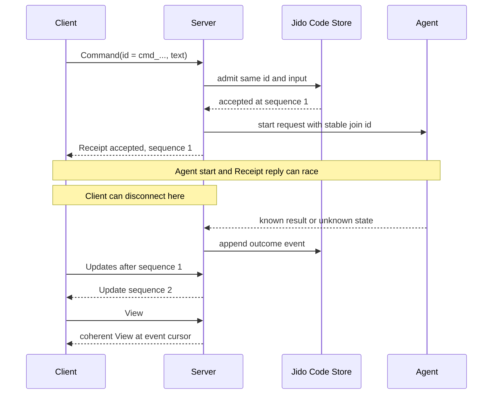

# Seigyo Protocol: Delivery

The precise replay and local application rules are in [Replay](replay.md).

## Identity, correlation, and retry

The Session ID names the shared context and event stream. The Command ID names
one logical command across retries, connections, and transports. The Store
Update sequence names one saved fact within a Session. The Signal envelope ID
names one encoded Signal instance; a replay may create a new envelope ID. A
transport request reference matches one call and one reply only. In the
current Jido AI bridge, the Agent request ID equals the Command ID. That
internal join is not a
required field for a general agent.

The client MUST choose a Command ID before first submit and keep the same
validated Command data for retry. The Store compares Session ID, kind, and
input values for a repeated ID. JSON object key order and Signal envelope ID
do not enter that comparison. Missing optional `model` and an explicit model
are different inputs, even when they select the same effective model. A
matching repeat returns `duplicate` with the original
admission revision and sequence, even after settlement. A changed value
returns `conflict`; it MUST NOT start another Agent request. A Command ID is
globally unique within one Store profile today. No client may reuse it for
another Session. The Signal envelope ID may change on retry.

An accepted Receipt has both `session_revision` and `sequence`; the sequence
is the `command_accepted` event. A duplicate Receipt repeats these original
values. A rejected Receipt has neither value and has a bounded error. An
invalid wire Signal gets `Failure`. A valid submission denied Session access
gets a rejected Receipt; reads and control mutations use `Failure`. An
accepted command can later fail or become uncertain. A client reads the
outcome event and a fresh View. It MAY read a bounded Trace.

The current native `Server.submit/2` accepts `expected_revision` outside the
Command Signal. That option is not part of client version 1. A remote adapter
MUST NOT expose a private revision precondition. If a later contract adds one,
it must save it with retry identity and define whether a duplicate checks the
old or current revision.

## Saved events, Progress, and coding activity

The Store saves EventRecords. Server renders each as an `Update` Signal.
Replay does not preserve an envelope ID. The `Update` type is a carrier for
Session order. Its `event_type` and `payload` MUST form a closed, versioned
pair. An open payload is not a safe public contract: it gives clients no
reliable schema and lets a new server change meaning inside version 1. Coding
v1 uses one ordered carrier and validates each advertised pair with a closed
Zoi schema. A new pair requires a protocol version or an explicit negotiated
capability. The reserved `kind: "gap"` branch has no fixed sequence meaning
and MUST NOT be sent.
Use `Failure` code `gap` for an unusable read cursor and
`ResyncRequired` for a live delivery gap.

`Progress` is a complete bounded replacement snapshot for one active
command. Its sequence is local to the Agent request stream, not the Store
sequence. A client applies a snapshot only when its sequence is greater than
the last Progress sequence it applied for that Command ID. It ignores an
older or equal snapshot, including one delayed across a reconnect. It MUST
NOT append snapshots as deltas, advance its replay cursor from Progress, or
settle work from Progress. After it applies a saved outcome, the client
discards later Progress for that Command ID, including delayed socket
frames. The server may lose or coalesce Progress. A saved
outcome and a coherent View replace it. Token deltas and partial reasoning
are not Jido Code Store events. Jido AI may retain reasoning in its separate
Agent checkpoint and return it through Trace. Remote reasoning text needs
an explicit visibility policy;
the default remote profile should set the required `thinking` field to an
empty string until that policy exists. The same default applies to Trace.

For any agent, durable common facts are admission, known outcome or
uncertainty, and the reference needed to read the committed result. The
Agent checkpoint or another profile state authority owns full output. A
bounded View is not a complete history. A general agent may supply its own
closed activity types and result projection without tools or Workspace.
The accepted input stays in the CommandRecord. The current coding Agent
checkpoint keeps committed conversation state. Each coding History entry
carries its Command ID for a stable Seigyo Protocol join. **Proposed:** a profile that
claims full history access must give a bounded read of older results by
Command ID or another stable reference. The recent View alone cannot make
that claim.

The coding profile needs more saved semantic activity before it can offer a
complete reconnect and audit view. **Proposed:** save a bounded `work_started`
summary, each effectful tool intent before execution, each known tool result
after execution, user approval or denial when that feature exists, a safe
change or artifact reference, and the final command outcome. Each item needs
a Command ID and Store sequence. Use a relative or opaque resource reference
and a redacted summary; do not put secrets, raw shell output, full file
content, or provider reasoning in the common event log. A tool result can be
"unknown" after a crash. This record supports inspection, but it does not
make an external effect exactly once. The current Store saves only admission
and outcome events; the current Trace is a bounded Jido AI read, not this
activity log. The exact coding event schemas require a new ADR and a new
protocol version or negotiated coding capability.

## Ordered replay, attach race, and View consistency

An Updates read takes `after_sequence` as an exclusive cursor. Cursor `0`
means no saved Update was applied. The Server returns increasing contiguous
sequences, up to the requested item limit and encoded page limit. The page
echoes the requested `after_sequence`. A client checks that value before it
checks that the first new sequence is its cursor plus one. It compares a
repeated `(session_id, sequence)` when it still has the applied Update.
Conflicting data for one replay key is a protocol error. After a client
restart, a saved cursor without duplicate evidence does not prove equivalence.
Read strictly after that cursor. Unverifiable overlap requires resynchronization. A cursor above the current Store head gets `Failure` code `gap`
and field `after_sequence`. A cursor below the retained floor also gets
`gap`; the client then reads a new View. The current Store keeps all events
and has no retention floor, so a retained-floor gap is a future Store rule.

The first remote profile must resolve old stored events before serving
replay. If it cannot encode one event under the selected protocol version,
it MUST NOT omit that event or advance the cursor past it. A migration or
closed translation may make it readable. Otherwise, the remote profile must
define a stable failure and View recovery rule for that case before release.
The current Store permits event names and payloads outside the draft remote
union, so this is a real migration gate.

`UpdatesPage.next_cursor` is the last item sequence when more items existed
at that read. Null means the page reached that read's head; later commits can
still arrive. An adapter MUST NOT return an empty page when a saved Update is
available after a valid cursor. If one event cannot fit the page byte limit,
it returns `too_large` and does not skip that event. A client advances its
cursor only after it applies an Update. A page or live frame can be replayed.

For live attach, the adapter first authorizes and registers a bounded buffer
for committed event notices. It then reads Store pages after the client's
cursor, sends them in order, drains the buffer, removes duplicates by replay
key, and enters live state. If an event commits between registration and the
read, it appears in the Store read, the buffer, or both. The adapter still
sends it once in order. If the buffer fills, a notice is lost, or order is
uncertain, the adapter sends `ResyncRequired` and stops claiming ordered live
delivery. The client reads from its own last applied cursor. A transport may
send a committed Update directly only if it preserves these same rules.

A `View` at `event_cursor = E` MUST show a coherent projection through E.
For every terminal event through E that cites Agent revision R, its Agent
projection must include R. The View MUST NOT show an Agent result from after
E as a settled result. The Server can use a pinned Agent snapshot or filter
its projection to committed command IDs through E. If it cannot form that
cut, it returns `unavailable` instead of an inconsistent View. A View read
does not change an existing valid replay cursor. On first use, or after a
Store `gap`, a client may apply the whole View and set its replay baseline to
E. It then reads Updates after E and accepts that older event detail was not
replayed. If the client has a valid cursor below E, it reads the missing
Updates before it advances that cursor. The Server filters its projection against committed facts.
`seigyo_test_009_view_race_test.exs` checks the coherent cut while settlement
is held before its durable commit.

A View is bounded. It shows recent messages, the active command, and recent
outcomes, but it does not replace old Update pages or a full Agent history. A
client that receives `gap` reads a fresh View and accepts that old event
detail outside the View window is no longer available through the protocol.
Retention terms must be stated by the selected Store profile.

## Failure and restart

The failure stage controls the client response. The complete coding v1 retry,
cancellation, and completion rules are in [Processing and recovery](processing.md).

| Stage | Response | Client rule |
| --- | --- | --- |
| Invalid envelope, data, or version | `Failure`; no admission | Correct input or identity. |
| Valid submission to an unavailable or unauthorized Session | Rejected `Receipt` with `not_found/session_id` | Do not infer whether the Session exists. |
| Valid command declined before admission | Rejected `Receipt`; no saved command | Resolve cause before a new attempt. |
| Call result lost after possible admission | No reliable conclusion | Retry the same Command ID and data. |
| Agent or provider fails after admission | Saved failed outcome `Update` | Read View and Trace. |
| Agent or effect state cannot be proved | Saved uncertain `Update` | Keep ID; wait for inspection or reconciliation. |
| Store or Agent state unavailable for a read | `Failure` code `unavailable` | Retry the read; do not infer an outcome. |

The Jido Code Store admission commit and Jido Agent checkpoint are separate. A
Store Receipt does not prove that Agent state was checkpointed. A checkpoint
does not prove that the Store saved an outcome. **Required:** future restart
reconciliation joins records by stable Session, Command, and internal request
IDs. It may settle a known result only from sufficient evidence. The current
startup does not inspect a Jido checkpoint to settle open commands. It marks
them uncertain and blocks the coding Workspace until inspection. It MUST NOT
automatically repeat an external tool effect after an uncertain crash. A
missing Agent checkpoint can make View and new admission unavailable even
while Store events remain readable.

The current file proof restores completed work after process restart,
recovers a torn final journal frame, and marks open commands uncertain. It
does not claim power-loss durability, atomic Jido Code and Agent commits,
automatic effect replay, or safe reuse of a Workspace after an unknown shell
process. Memory Store data does not survive process loss. A future shared
Store profile must state and test its own failure model.
