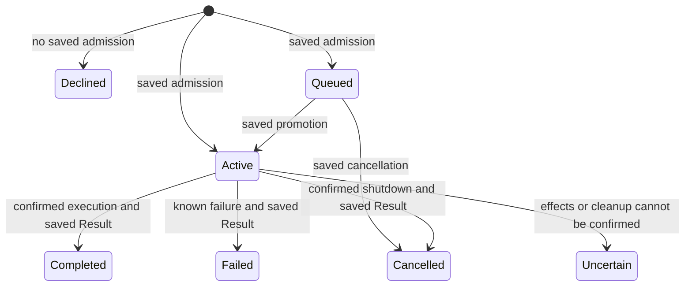

# Seigyo Protocol processing and recovery

These rules describe coding v1. They preserve its saved inputs, retry keys,
error codes, and receipt shapes. Internal Agent revisions and process identity
are implementation details. They are not client inputs.

## Retry keys

| ID | Requirement |
| --- | --- |
| SEIGYO-PROCESS-001 | A retry MUST retain its durable key and semantic request data. Envelope IDs, transport references, JSON object key order, and connection identity do not enter the comparison. Ordered arrays and exact Unicode strings do. Implementations MUST NOT normalize case or Unicode on retry. A schema default applies only when that schema defines it. Absent, null, and empty remain distinct unless explicitly stated below. |
| SEIGYO-PROCESS-002 | A committed key and equal data MUST return the saved decision without a second effect. Changed data MUST conflict. Concurrent identical requests MUST converge on one saved decision. A declined admission that saved no Command does not reserve its Command ID. Current authorization MUST be checked before a saved decision is disclosed. |
| SEIGYO-PROCESS-003 | Retry records MUST remain for the declared storage lifetime. Coding v1 has no expiry or key reuse window. Capacity exhaustion MUST reject new work without deleting an earlier retry record. A server that loses its memory Store has lost its Session contract; it MUST NOT claim continued recovery of that Session. A later retention policy needs an explicit contract and cannot silently make an old key executable again. |

| Operation | Key and scope | Data compared and repeat behavior |
| --- | --- | --- |
| `open` | Session ID within the Store | Reopens the same authorized Session. A null Workspace chooses the server default for new creation; reopening does not change the saved Workspace. |
| `submit`, `submit_turn` | Command ID across all Sessions in one Store | Session ID, kind, and input. Text and model values compare exactly. Array order matters. Absent `attachment_ids` differs from `[]`; null is invalid. `submit_turn` converts to input with an Attachment array. A valid delivery or revision precondition is checked for new admission only. Repeat returns the original admission sequence and revision; it does not repeat execution. |
| `configure` | Mutation ID across configuration mutations in one Store | All validated data, including Session ID, expected revision, patch, and apply policy. Repeat returns the original saved configuration and decision sequence with `duplicate`, even if later revisions exist. |
| `steer_turn`, `cancel_turn` | Mutation ID across both controls in one Store | Action, Session ID, target Command ID, text or reason, and ordered Attachment IDs. Repeat identifies the original saved control. It does not deliver that control again. |
| `fork` | Mutation ID across forks in one Store | Source, child ID, relation, cut point, and Workspace policy. Repeat returns the same child. |
| `workspace_configure` | Mutation ID within the authenticated owner's Workspace catalog | All validated configuration data. Repeat returns the original Workspace projection, including its original version. |
| `attachment_begin` | Attachment ID within the Attachment store | Session and the complete content declaration. Repeat returns current upload state if the declaration matches. |
| `attachment_chunk` | Attachment ID and chunk index | Decoded bytes must match a saved chunk while uploading. After commit, chunks are no longer accepted; read the repeated commit response to establish success. |
| `attachment_commit` | Attachment ID and owning Session | Repeat returns the committed or rejected state. The saved content does not change. |
| Reads and watches | No durable mutation key | Repeat the read with its cursor. Watches are connection state. |

The Mutation namespaces above are separate in v1. Clients SHOULD generate a
fresh Mutation ID for each distinct intent, even across those namespaces.
This rule does not introduce a new shared namespace that could conflict with
existing saved records. Private digest encodings are not wire retry keys.

## Admission and completion

| ID | Requirement |
| --- | --- |
| SEIGYO-PROCESS-004 | An accepted Receipt proves that admission was saved at its sequence. It does not prove dispatch, a model reply, or completion. Save the required Result and terminal Update before publication. An implementation can use more than one persistence transaction, but it MUST NOT expose a terminal reference with no readable Result. |
| SEIGYO-PROCESS-005 | A confirmed Result with `completion: execution` requires the known request outcome, completion of required work after commit, and release of execution ownership. An Agent state commit, Progress, Trace, or control reply alone is insufficient. Required work includes request worker shutdown for cancellation. The Workspace admission reservation remains until the outcome is saved, then ends before queue promotion. Effects that already completed are not rolled back. Detached external processes and remote effects outside the declared execution scope are not claimed to be stopped. |
| SEIGYO-PROCESS-006 | A call timeout or disconnect stops the client's wait; it MUST NOT cancel admitted work. A connection failure, protocol Failure, rejected Receipt, and saved execution outcome are different facts. Recovery MUST use saved protocol evidence. A failed read proves no outcome. |
| SEIGYO-PROCESS-007 | Queued cancellation saves a terminal cancelled Result without dispatch. Active cancellation saves a request to cancel the named Command. Its `applied` control disposition means the control was committed and delivered; it does not mean worker shutdown is complete. Only the saved Result establishes confirmed cancellation. If required shutdown cannot be confirmed, save `uncertain` and prevent unsafe new execution. A late cancel MUST remain bound to its original target. |
| SEIGYO-PROCESS-008 | Steering is bound to its target Command. The saved control and `applied` reply prove acceptance into that request's input path. They do not prove that a model consumed the text before completion. A retry MUST NOT steer a later Command. A control that loses the completion race can fail with `conflict/state` or become a saved control followed by the original terminal outcome. |
| SEIGYO-PROCESS-009 | A terminal Result and its Update MUST be immutable. A stale completion cannot replace them or append a second terminal outcome. `uncertain` preserves unknown effects; it is not permission to retry execution. Coding v1 has no public operation that reconciles uncertainty or unlocks an uncertain Workspace. Inspection or operator recovery must retain the original evidence. |
| SEIGYO-PROCESS-010 | Recovery MUST preserve Session and Command IDs. After owner loss, reconcile saved admission and outcome before any dispatch. A saved open Command whose effects cannot be established becomes uncertain. Recovery MUST NOT infer safe re-execution from the absence of diagnostics. |

The public lifecycle is:

Admission, model/tool execution, and settlement can overlap replies on other
connections. There is no global response order. The Session sequence orders
saved facts. Request references only match replies, as specified in
[Messages](messages.md).

## Failure, time, and persistence

| Evidence | Client action |
| --- | --- |
| Invalid input or unsupported version | Correct the input. No admission is proved. |
| `not_found/session_id` | Treat the Session as unavailable to this caller. The server uses the same result for hidden and unknown Sessions. |
| Rejected Receipt | Resolve the cause. Its key has no saved admission; a later attempt can succeed. |
| Lost or timed out submit reply | Retry the same ID and data. Read saved Updates and Result. |
| `conflict/id` or `conflict/mutation_id` | Recover the original intent; do not overwrite its saved identity. |
| Result `failed` | Required work stopped with a known failure. A new intent needs a new Command ID. |
| Result `uncertain` | Preserve the ID and evidence. Do not automatically re-execute effects. |
| `unavailable` during a read or persistence failure | Retry a read or reconcile the durable key. Absence of a reply does not prove absence of a write. |

Call timeouts are local client wait limits. The server execution wait limit
bounds how long the bridge can establish an outcome. An Agent execution
deadline bounds that request's execution policy. Idle timeouts concern runtime
placement or a connection, not Session deletion. Retention concerns saved
facts and retry keys. These are different clocks. Wire durations use explicit
milliseconds where specified; no wall-clock synchronization establishes order.

Memory storage survives a client or Agent failure while its Store remains
alive. It does not survive Store loss. The file profile recovers persisted
Sessions, outcomes, and retry records after a full server process restart.
It marks open work uncertain. Its tested journal recovery does not promise
power-loss durability or an atomic commit with an external provider. A saved
failure to publish is repaired by replay, not by repeating the effect.

## Proof map

| Rule | Independent behavior evidence |
| --- | --- |
| 001–003 | Duplicate/conflicting and concurrent Command scenarios; cross-operation retry; configuration, fork, Workspace, and Attachment retry scenarios; file restart with the same key |
| 004–006 | Lost admission reply, blocked settlement, View race, known failure, timeout with late Reply, and disconnect recovery |
| 007–008 | Queued and active cancellation, held worker shutdown, late target controls, steering, and queue promotion |
| 009–010 | Effect before timeout, late completion after uncertainty, owner loss, and full server restart |

The acceptance suite controls faults through fixture setup. Its assertions
use Receipts, Updates, Results, Views, or authorized protocol reads. Runtime
PIDs and diagnostic events are not conformance evidence.
